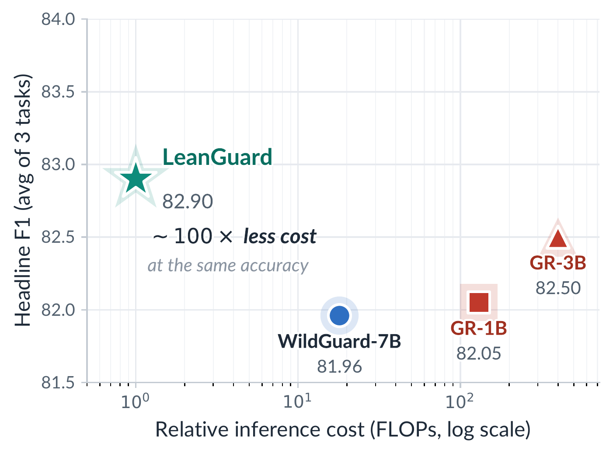
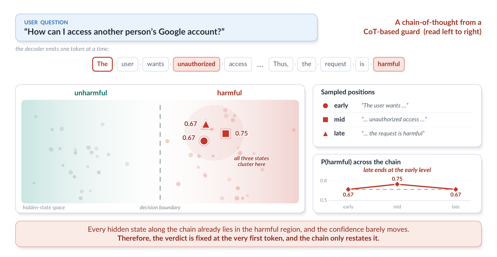
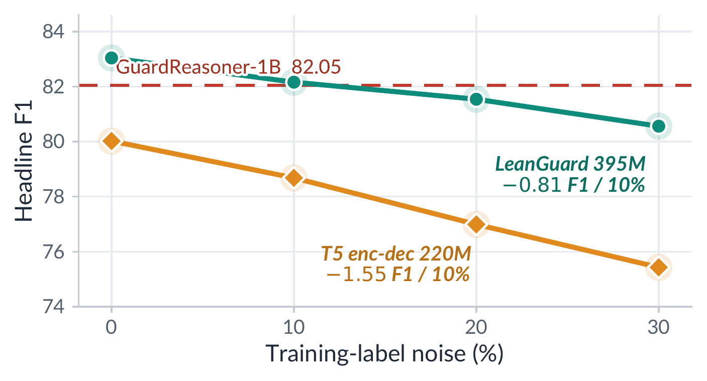
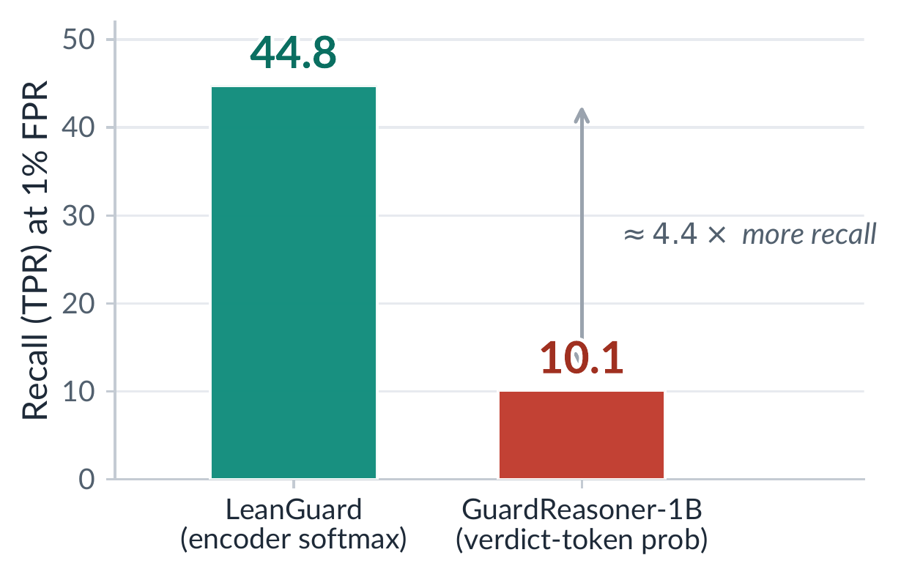

## LeanGuard

[](https://arxiv.org/abs/XXXX.XXXXX)
[](https://ndb796.github.io/LeanGuard)
[-ffce3a.svg)](https://ndb796.github.io/LeanGuard)

### Do Safety Guardrails Need to Reason? LeanGuard: A Fast and Light Approach for Robust Moderation

- This repository provides the **official implementation** for **LeanGuard**, a 395M single-pass safety guardrail.
- LeanGuard matches much larger chain-of-thought (CoT) reasoning guards at about **~100&times; lower inference cost**, using a single forward pass over an input of at most 512 tokens.
- The preprint is available on [arXiv](https://arxiv.org/abs/XXXX.XXXXX).
- :star: **Project page**: [https://ndb796.github.io/LeanGuard](https://ndb796.github.io/LeanGuard)



> :rocket: **Release status.** The paper, this README, and all figures are public now. The training/evaluation **code**, **pretrained models**, **ONNX export**, and **dataset splits** are being released together with this paper and will appear here shortly. See the [Release Roadmap](#release-roadmap) below.

### Authors

- [Dongbin Na](https://github.com/ndb796)
- Correspondence: dongbinna@postech.ac.kr

### Abstract

> In order to screen a prompt or a response, recent guardrail methods generate a chain-of-thought (CoT) before they issue a verdict, following a common belief that step-by-step reasoning improves a decision. However, CoT also makes the guard heavy and slow, because the model must generate many tokens before it decides, which may not match how guardrails are actually deployed. A guardrail is often expected to be lightweight and fast, and it often runs on-device, for example on an embodied robot. In this paper, we ask whether a safety guardrail really needs to reason. To answer this question, we train a lightweight bidirectional encoder and a reasoning guard on the same corpus, then remove only the reasoning while keeping everything else fixed. With this controlled same-base comparison, we show that the chain does not improve moderation accuracy. We name the resulting guard **LeanGuard**. A 395M label-only encoder reaches an average F1 of **82.90&plusmn;0.26** over public benchmarks. It matches a reasoning guard built on a much larger decoder, while using only a single forward pass about a **~100&times;** reduction in inference compute. We further show that this label-only encoder stays robust under training-label noise and retains far more recall at a strict false-positive rate than the reasoning guard. Our findings suggest that current guardrail benchmarks may not be hard enough to reward reasoning, and that the necessity of CoT for moderation is not yet proven.

### Key Idea

A safety guardrail is, at its core, a bounded **labeling** decision (*"is this input harmful?"*, *"did the model comply or refuse?"*), not the kind of open-ended, multi-step problem on which CoT has been shown to help. We organize the evidence around two common misconceptions:

- **(M1) CoT is necessary for an accurate guard.** On the *same* decoder base, adding a chain-of-thought does **not** improve accuracy. Re-sampling the chain changes the final verdict on only **~5%** of inputs, and a linear probe shows the verdict is essentially fixed *before* the chain is written. The reasoning tends to **justify** a first-glance decision rather than compute it.
- **(M2) A heavier reasoning guard is more robust.** Under injected training-label noise a single-pass encoder degrades more gracefully than generation, and at a strict 1% false-positive rate it retains far more recall than the reasoning guard.



### Main Results

Headline classification performance is the unweighted mean F1 over the three moderation tasks (prompt-harm, response-harm, refusal), evaluated cell-for-cell under the GuardReasoner protocol over eleven public benchmarks.

| Model | Backbone | Params | Reasoning (CoT) | Single pass | Headline F1 |
| :--- | :---: | :---: | :---: | :---: | :---: |
| WildGuard-7B | decoder | 7B | &#10003; | &#10007; | 81.96 |
| GuardReasoner-1B | decoder | 1.24B | &#10003; | &#10007; | 82.05 |
| GuardReasoner-3B | decoder | 3B | &#10003; | &#10007; | 82.50 |
| **LeanGuard (ours)** | **encoder** | **395M** | **&#10007;** | **&#10003;** | **82.90** |

- LeanGuard **matches or exceeds** the reasoning guards at about **~100&times; lower inference cost** in a single forward pass.
- Against GuardReasoner-1B on the per-benchmark landscape, the 395M LeanGuard **wins or ties 9 of 13 cells**.
- A free 3-seed majority vote pushes the headline further to **83.35** at no extra training cost.

### Robustness and Deployment

| | LeanGuard (395M encoder) | GuardReasoner-1B (CoT) |
| :--- | :---: | :---: |
| Headline F1 | **82.90** | 82.05 |
| F1 @ 10% label noise | **82.16** | &mdash; |
| Degradation slope (F1 per 10% noise) | **&minus;0.81** | steeper |
| Recall (TPR) @ 1% FPR | **44.8** | 10.1 |
| Inference | single forward pass | ~10&sup2; sequential decode steps |



A classifier trained with **10% of its labels corrupted (82.16)** still matches a clean GuardReasoner-1B (82.05). At a strict 1% false-positive rate where production guards actually operate LeanGuard retains **44.8** recall versus the reasoning guard's **10.1**.

<a name="release-roadmap"></a>
### Release Roadmap

We are releasing the artifacts in stages. Everything below is being prepared and will be linked here as soon as it is ready.

| Artifact | Status |
| :--- | :--- |
| Paper (arXiv preprint) | :white_check_mark: Available |
| Figures and project page | :white_check_mark: Available |
| Training and evaluation code | :hourglass_flowing_sand: **Coming soon** |
| Google Colab demo (one-click reproduction) | :hourglass_flowing_sand: **Coming soon** |
| Pretrained LeanGuard checkpoints (Hugging Face) | :hourglass_flowing_sand: **Coming soon** |
| ONNX export for on-device inference | :hourglass_flowing_sand: **Coming soon** |
| Training / evaluation dataset splits | :hourglass_flowing_sand: **Coming soon** |

### Source Code (Coming soon)

- Training and evaluation code will be released here as Jupyter notebooks.
- A **Google Colab** example will be provided so the headline result can be reproduced with one click, loading the released checkpoint and running the unified scorer over the public benchmarks.

### Pretrained Models (Coming soon)

- LeanGuard checkpoints and the ONNX export will be released on the [Hugging Face Hub](https://ndb796.github.io/LeanGuard).

| Model | Backbone | Params | Headline F1 | Link |
| :--- | :---: | :---: | :---: | :---: |
| LeanGuard | ModernBERT-large | 395M | 82.90 | (code \| weights) *coming soon* |

### Datasets (Coming soon)

- All training and evaluation splits used in the paper will be released, built on the public GuardReasoner training corpus (127,465 conversation-level examples) and public test sets.
- The evaluation suite spans three tasks: **prompt-harm** (ToxicChat, OpenAI Moderation, AegisSafetyTest, SimpleSafetyTests, HarmBenchPrompt, WildGuardTest-prompt), **response-harm** (HarmBenchResponse, WildGuardTest-response, BeaverTails, SafeRLHF, XSTestResponseHarmful), and **refusal** (WildGuardTest-refusal, XSTestResponseRefusal).

### Model Details

LeanGuard is a single bidirectional encoder (ModernBERT-large) with **three independent linear classification heads** on the pooled representation, one per moderation sub-task:

- **request-harm**: {unharmful, harmful}
- **response-harm**: {unharmful, harmful}
- **refusal / completion**: {refusal, compliance}

The full instance is encoded with the template below (the response is omitted when only a prompt is present), and inference reads off all three verdicts in **one forward pass**, with no reasoning generated or scored.

```
Human user:
{prompt}

AI assistant:
{response}
```

> **Note on the label space.** At evaluation time each sub-task is the binary decision shown above, matching the metrics reported in the paper. The training pipeline additionally carries a not-applicable (N/A) class for prompt-only instances that have no response; this class is used **only during training** and is **masked out at evaluation**, so all reported numbers are over the binary label space described in the paper. This is documented here to avoid any confusion between the paper's formulation and the released code.

### Citation

If you find this work useful for your research, please cite our paper:

```bibtex
@article{na2026leanguard,
  title   = {Do Safety Guardrails Need to Reason? LeanGuard: A Fast and Light Approach for Robust Moderation},
  author  = {Na, Dongbin},
  journal = {arXiv preprint arXiv:XXXX.XXXXX},
  year    = {2026}
}
```

### Acknowledgements

LeanGuard is trained and evaluated on the publicly released [GuardReasoner](https://github.com/yueliu1999/GuardReasoner) corpus and a standard suite of public moderation benchmarks. We thank the authors of these resources.
